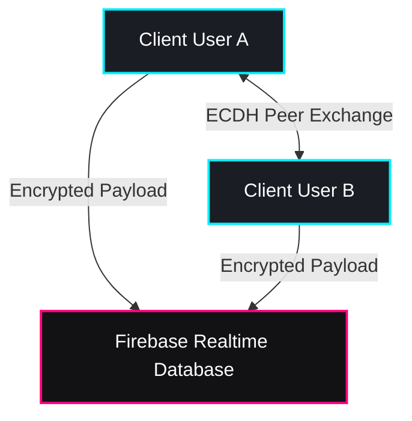

# 🛡️ Pulxo Chat: Military-Grade Secure Chat Application

Welcome to **Pulxo Chat** — a state-of-the-art, highly secure, end-to-end encrypted (E2EE) real-time chatting platform built with React, Vite, and Firebase Realtime Database. Designed with premium dark-ops aesthetics, custom micro-animations, and unmatched client-side privacy layers, it represents the absolute peak of modern secure communications.

---

## ✨ Primary Features

### 1. 🧬 Cryptographic Security (End-to-End Encryption)
* **Elliptic Curve Cryptography (ECC):** Secure, modern public/private keypair generation right inside the client.
* **Shared Secret Derivation:** Direct peer-to-peer key agreement using Elliptic Curve Diffie-Hellman (ECDH) protocols.
* **Zero-Knowledge Backend:** The database only stores cryptographically randomized `encryptedData`. Neither Google/Firebase nor any interceptor can read your communications.

### 2. 🕵️‍♂️ Multi-Layered Privacy Protection (Pulxo Privacy Protocol)
* **Anti-Screenshot & Print Block:**
  * Globally disabled text selection, context menus, right-clicks, and long-press option menus.
  * Listeners for keyboard shortcuts (`PrintScreen`, `Cmd+Shift+3/4/5`, `Ctrl+P`) which immediately block visibility and trigger high-priority security warnings.
* **Tab & App Switch Obfuscation:**
  * Uses the **Page Visibility API** to instantly hide the entire chat feed under a highly polished "MISSION BLOCKED" glass overlay whenever the window or tab loses focus.
* **DevTools Intrusion Heuristics:**
  * Continuously evaluates viewport and outer window size discrepancies to detect inspect-tool panels, instantly blurring application contents on trigger.
* **Dynamic Drifting Watermark:**
  * A continuous, randomized floating watermark showing the current user's UID, timestamp, and a unique session ID. This effectively deters any optical capturing (external camera photography) by guaranteeing traceability.
* **Vibration Deterrents:**
  * Tactical haptic feedback warnings on unauthorized actions or capture attempts.

### 3. ⏳ Snapchat-Style Ephemerality
* **Auto-Cleanup on Exit:** As soon as a user reads a message and exits the chat room (or logs out), the read messages are permanently wiped from the Realtime Database (`seen` messages are deleted programmatically on cleanup).

### 4. 🔐 Application Lock Screen
* **Secured Passcode Protocol:** App-wide access is restricted by a highly secure login layer coupled with a localized passcode system.

---

## 🔒 Firebase Realtime Database (RTDB) Security Rules

To ensure complete production safety and prevent bad actors from tampering with the database or reading other users' metadata, deploy the following security rules in your Firebase console.

These rules have been pre-configured in [database.rules.json](file:///Users/grishmmahorkar/Desktop/Private/database.rules.json).

```json
{
  "rules": {
    ".read": false,
    ".write": false,
    "users": {
      "$uid": {
        // Any authenticated user can read profiles (for searching and user lists)
        ".read": "auth != null",
        // Only the owner of the profile can write or modify it
        ".write": "auth != null && auth.uid === $uid"
      }
    },
    "usernames": {
      // Any authenticated user can check username availability
      ".read": "auth != null",
      "$username": {
        // A user can register/modify a username map only to point to their own UID or clear it if it belonged to them
        ".write": "auth != null && (!data.exists() || data.val() === auth.uid) && (newData.val() === auth.uid || !newData.exists())"
      }
    },
    "messages": {
      "$chatId": {
        // Only the two participants of the chat (whose UIDs make up the sorted chatId like uid1_uid2) can access the room
        ".read": "auth != null && $chatId.contains(auth.uid)",
        ".write": "auth != null && $chatId.contains(auth.uid)"
      }
    },
    "presence": {
      "$chatId": {
        // Only participants can read other participant presence
        ".read": "auth != null && $chatId.contains(auth.uid)",
        "$uid": {
          // A user can only write their own presence status
          ".write": "auth != null && auth.uid === $uid && $chatId.contains(auth.uid)"
        }
      }
    },
    "typing": {
      "$chatId": {
        // Only participants can read typing indicators in a chat room
        ".read": "auth != null && $chatId.contains(auth.uid)",
        "$uid": {
          // A user can only write their own typing status
          ".write": "auth != null && auth.uid === $uid && $chatId.contains(auth.uid)"
        }
      }
    },
    "note_replies": {
      "$ownerUid": {
        // Users can read replies to their own notes
        ".read": "auth != null && auth.uid === $ownerUid",
        // Any authenticated user can write a reply
        ".write": "auth != null"
      }
    }
  }
}
```

### How to Import Rules:
1. Go to the **Firebase Console**.
2. Select your project and navigate to the **Realtime Database** section.
3. Click on the **Rules** tab.
4. Replace the existing rules with the contents of `database.rules.json` (or copy the JSON block above).
5. Click **Publish**.

---

## 🛠️ Local Development & Quick Start

### Prerequisites
* [Node.js](https://nodejs.org/) (v16+ recommended)
* A Firebase account and project set up.

### Installation
1. Clone the repository:
   ```bash
   git clone https://github.com/GRISHM7890/pulxo-chat.git
   cd pulxo-chat
   ```
2. Install the dependencies:
   ```bash
   npm install
   ```
3. Configure your Firebase credentials inside `src/firebase.js`:
   ```javascript
   const firebaseConfig = {
     apiKey: "YOUR_API_KEY",
     authDomain: "YOUR_AUTH_DOMAIN",
     projectId: "YOUR_PROJECT_ID",
     storageBucket: "YOUR_STORAGE_BUCKET",
     messagingSenderId: "YOUR_MESSAGING_SENDER_ID",
     appId: "YOUR_APP_ID",
     databaseURL: "YOUR_DATABASE_URL"
   };
   ```
4. Run the development server locally:
   ```bash
   npm run dev
   ```
5. Build the application for production deployment:
   ```bash
   npm run build
   ```

---

## 🎖️ Architecture Overview



* **Frontend Framework:** React 19, powered by Vite for blazing-fast HMR and build optimizations.
* **Component-Level Styling:** Vanilla CSS containing rich variable definitions (`--bg-primary`, `--accent-cyber`, etc.) for absolute visual customizability.
* **Security & Auth Services:** Firebase Authentication (User Identity Management) and Firebase Realtime Database (Real-time socket communication).

---
*Developed under the guidance of the **PULXO INSTITUTE OF AI**. Keep your chats secure, soldier.*
